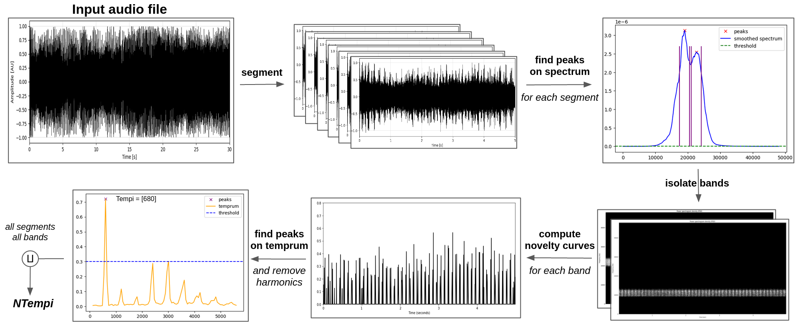

# NTempi

**NTempi** (Number of tempi) is an acoustic index designed for orthoptera acoustic richness estimation.  It aims at counting the number of distinct stridulation tempi within a given audio file. 


## How to use

NTempi can be used by downloading the code from source. From a terminal, procedure is as follows:

First, clone repository and make sure all required packages are installed.
```bash
$ git clone https://github.com/nathan-line/ntempi.git
$ pip install -r requirements.txt
```


Then, run tests to ensure everything works as supposed to.
```bash
$ cd ntempi
$ python3 tests.py 
```
After a short time, the script should print the following: 'Tests worked as intended!'.


To compute the NTempi index on 
* A given audio file at _file\_path_:
```bash
$ python3 NTempi.py file_path
```

* All audio files of a given folder at path _fold\_src_, saving result as a csv at _path\_dst_:
```bash
$ python3 NTempi_df.py fold_src path_dst
```


## Context

Orthoptera is an order of the insect class, regrouping both grasshoppers and bushcrickets. It corresponds to vocalizing species, that are capable of producing highly percussive sounds through stridulation. The rationale behind the acoustic index is the following:  at a fixed time of the day, different orthoptera species will produce percussive stridulations at different tempi, and one given species mostly stridulates at one single tempo. The number of tempi thus appears as a relevant proxy for the number of different vocalizing species.


## Functional description

NTempi index takes as input an audio file and returns a single value. It works as a proxy for acoustic richness (in a one-one correlation fashion) and has proven to be relatively robust to multiple percussive sources, potentially overlapping. Detailed workflow is as follows:
  

<div align="center">
    
</div>
  

(a) **Segmentation**: First step of the Ntempi computation consists in dividing the audio file into smaller segments of equal length, in order to work on each one of those separately.

(b) **Band separation**: Spectrum is first smoothed with a running mean method. Peaks in the smoothed spectrum, corresponding to frequency bins of highest energy, are then identified using a peak detection technique (absolute thresholding and prominence).The obtained points are finally exploited to isolate bands of interest, with a fixed bandwidth around them.

(c) **Temprums**: Each selected frequency band is turned into a novelty curve, using log transform and discrete derivative computation. Obtained curves are then discretized, and finally transformed into temprum - onset tempo density - using another Fourier transform. 

(d) **Tempo identification**: Peak in the temprums are then identified using another detection technique combining relative thresholding and prominence. Harmonics are removed, within an epsilon error margin.

(e) **Final computation**: Tempi obtained from all temporal segments and all frequency bands are
gathered together using distinct union with a delta margin. This results in a list of all tempi, the Ntempi acoustic index then returns the length of this list. 


## Code structure and dependencies

_NTempi_ code is separated into several parts, making use of auxiliary functions defined in the _aux\_files_ folder. Each auxiliary file corresponds to a particular part of the workflow described above, namely :
- _band\_separation.py_ for step (b) : spectrum-based peak identification and band separation.
- _temprums.py_ for step (c) : novelty curve computation and discretization, Fourier transform.
- _tempo\_identification_ for step (d) : temprum-base peak identification, harmonic removal.

Final index computation is done via the Ntempy() function within the _Ntempy.py_ file. It takes care of preprocessing step (a) and postprocessing step (e) of the workflow. An additionnal _Ntempy\_df.py_ script makes it possible to compute the index on all audiofiles of a given folder, saving the result in a csv dataframe.

The index computation uses the following (standard) Python packages:
numpy, matplotlib, pandas, maad [1], scipy, librosa. os, sys, path.

They are imported via the _dependencies.py_ file.


## Test dataset

It consists in 1 audio recording from the Risoux forest in Haut-Jura, presenting a diversity in the number of vocalizing species.


  

## Parameters

The index computation involves several parameters, some automatically computed and other that are set (and may be modified) in the _params.py_ file. 
Among such parameters should be mentioned :
- Fc0 : spectral bandwidth to be kept for all input audio files. Field knowledge on orthopterans led to removing frequencies below 6000Hz and above 40000Hz.
- tlen0 : subsegment duration for preprocessing step (a). Default value is set to 5 seconds, resulting from empirical knowledge regarding characteristic duration of orthoptera stridulations.
- t0, win0 : absolute threshold for peak detection and window size for band isolation in step (b). Threshold t0 may be tuned on microphone white noise. Window size does impact much the index calculation, as the objective is to retrieve tempo around a frequency peak. It is recommended not to play on this parameter.
- Q0 : quantile for discretization threshold for novelty curves in step (c). Default value set to 0.8, meaning only highest 20% amplitudes are kept.
- t1, prom_c0 : relative threshold and prominence for peak detection in temprum at step (d). Parameter t1 is pretty critical, default value is set to 0.3 meaning a temprum peak has to account for more than 30% of all energy of the temprum to be kept.
- eps0, delta0 : margins for tempo merging at steps (d) and (e). Default values are set to 60BPM (to say, 1Hz), considered as the uncertainty range under which it seems impossible to distinguish two obtained tempi.

Results presented in [] correspond to the index computed with parameters all set to defaut values as presented above.


## Acknoledgements

This work was initated in the context of a final year internship, alongside the Ecoacoustics Research (EAR) team of the MNHN. It was pursued and finalised with the support of OFB. Special thanks are addressed to Frédéric Sèbe, Jérôme Sueur and Sylvain Haupert for their contributions and precious reviews.


## Citation

[...]


## Bibliography

[1] Ulloa, J. S., Haupert, S., Latorre, J. F., Aubin, T., and Sueur, J. (2021). scikit-maad: An open-source and modular toolbox for quantitative soundscape analysis in python. Methods in Ecology and Evolution, 12(12):2334–2340.  
[2] Müller, M. (2015). Fundamentals of music processing: Audio, analysis, algorithms, applications.  
[3] Bellisario, K. M. and Pijanowski, B. C. (2019). Contributions of mir to soundscape ecology. Part i: Potential methodological synergies. Ecol. Informatics, 51:96–102.  
[4] Welch, P. (1967). The use of fast fourier transform for the estimation of power spectra: A method based on time averaging over short, modified periodograms. IEEE Transactions on Audio and Electroacoustics, 15(2):70–73.  
[5] Sueur, J., Pavoine, S., Hamerlynck, O., and Duvail, S. (2008). Rapid acoustic survey for biodiversity appraisal. PloS one, 3:e4065  
